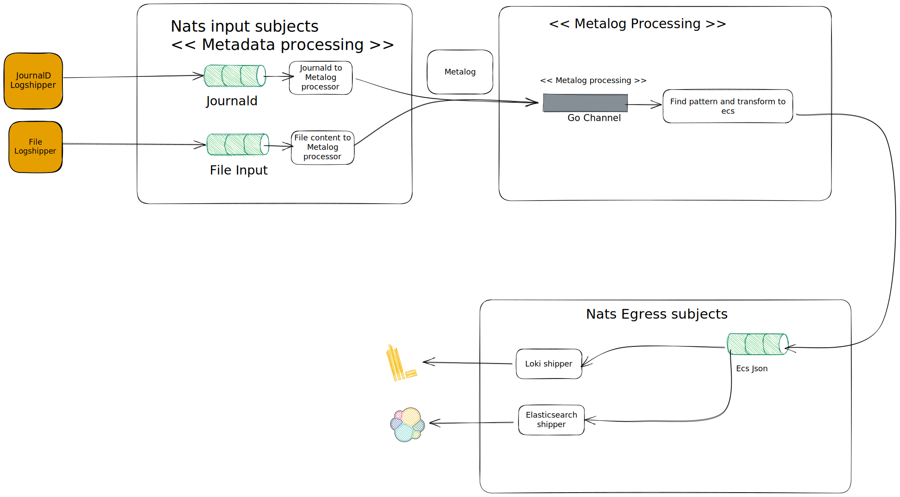

# Logunifer unifies logs form various sources to Elastic Common Schema

Logunifier receives logs over nats subscription(s) and converts and enrich logs into elastic common schema format. The enriched logs are pushed in the subscription egress.logs.ecs in json format. Any external system can subscribe to egress.logs.ecs and ship the logs on its desired sink(s).

The shipment of logs to loki is implemented by this module. 

## How its works

